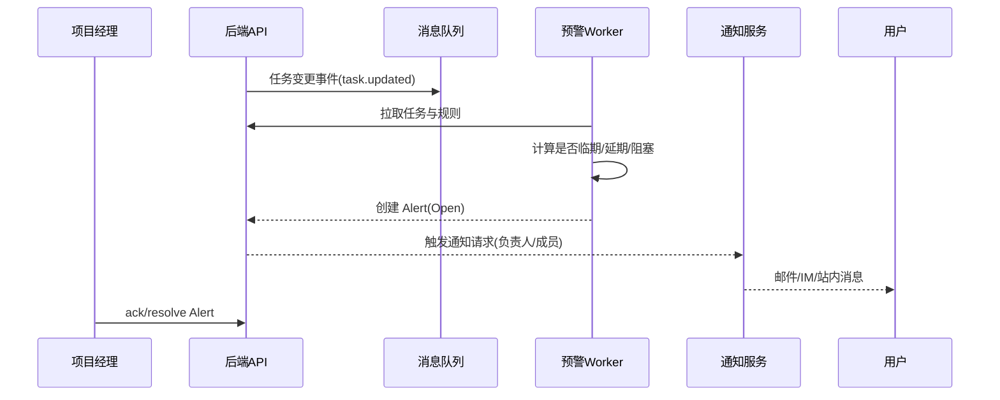
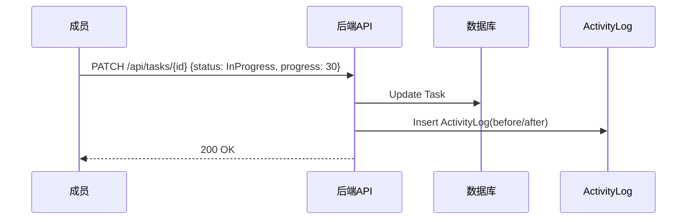

# 项目任务管理系统 API 设计文档（中文）

版本：v1.0（参考版）
说明：当前仓库未提供现成 API 定义，本文基于 PRD 与功能清单提出一套可落地的 API 输入/输出与系统设计，后续可据实际技术栈进行适配。

---

## 1. 概述

- **目标**：支撑“项目-任务-依赖-里程碑-进度-预警-通知-报表”的核心业务闭环，保证一致的接口风格、可靠的权限控制、可扩展的事件与异步能力。
- **风格**：RESTful（JSON），OpenAPI 3.1 可生成文档；对报表/复杂筛选提供灵活查询参数；对实时场景预留 Webhook/事件订阅。

---

## 2. 接口基础约定

- **协议**：HTTPS，UTF-8，`Content-Type: application/json`
- **认证**：OAuth2.1 + JWT（`Authorization: Bearer <token>`），支持租户/组织隔离（`X-Tenant-Id`）。
- **幂等**：对“创建/变更/通知发送”支持 `Idempotency-Key` 以避免重复。
- **时区/时间**：时间戳使用 ISO8601（UTC），显示由客户端本地化。
- **分页**：`page`、`pageSize`，或 `cursor`（游标模式，用于海量数据）。
- **排序/过滤**：通用参数 `sort=field:asc|desc`，`filter[field]=op:value`。
- **错误码**：HTTP 状态 + 业务码（见 3.4）。

---

## 3. 通用模型与响应格式

### 3.1 通用响应包装
```json
{
  "success": true,
  "code": "0",
  "message": "OK",
  "data": {}
}
```
- 失败示例：
```json
{
  "success": false,
  "code": "VALIDATION_ERROR",
  "message": "plannedEnd must be later than plannedStart",
  "data": null,
  "traceId": "1a2b3c"
}
```

### 3.2 核心资源与字段（概要）
- `Project`: `id, name, departmentId, ownerId, status, plannedStart, plannedEnd, actualEnd, progress, completionRate, remark, createdAt, updatedAt`
- `Milestone`: `id, projectId, name, dueDate, status`
- `Task`: `id, projectId, parentId, name, assigneeId, priority, status, plannedStart, plannedEnd, actualStart, actualEnd, estimateHours, spentHours, progress, tags[]`
- `TaskDependency`: `id, taskId, dependsOnTaskId, type(SS/FS/SF/FF)`
- `Membership`: `id, projectId, userId, role(Owner|PM|Member|Guest)`
- `Alert`: `id, projectId, taskId?, type, severity, message, state(Open|Ack|Resolved)`
- `Notification`: `id, channel, target, templateId, payload, status`
- `ActivityLog`: `id, actorId, entityType, entityId, action, before?, after?, createdAt`

### 3.3 分页响应结构
```json
{
  "success": true,
  "code": "0",
  "message": "OK",
  "data": {
    "items": [ {"id": "..."} ],
    "page": 1,
    "pageSize": 20,
    "total": 135
  }
}
```

### 3.4 常见错误码
- `UNAUTHORIZED`（401）：未认证或令牌过期
- `FORBIDDEN`（403）：无权访问资源
- `NOT_FOUND`（404）：资源不存在
- `VALIDATION_ERROR`（422）：业务字段校验失败
- `CONFLICT`（409）：版本冲突（乐观锁）或依赖冲突
- `RATE_LIMITED`（429）：频率限制
- `INTERNAL_ERROR`（500）：服务器内部错误

---

## 4. 认证与权限

- **租户隔离**：请求头 `X-Tenant-Id`；资源按租户分区。
- **RBAC**：系统角色（Admin/Leader/PM/Member/Guest）+ 对象级 ACL（项目成员/可见性）。
- **字段/操作级**：对敏感字段（用时、绩效相关）可做角色可见与操作限制。
- **审计**：所有写操作落 `ActivityLog`，带 `traceId` 贯穿链路。

---

## 5. 资源接口设计（示例）

说明：以下仅列核心端点与代表性入参/出参，实际实现建议以 OpenAPI 文档生成。

### 5.1 项目 Project
- 创建项目：`POST /api/projects`
```json
{
  "name": "Apollo",
  "departmentId": "dep-001",
  "ownerId": "u-100",
  "plannedStart": "2025-10-10T00:00:00Z",
  "plannedEnd": "2025-12-31T00:00:00Z",
  "remark": "新产品发布"
}
```
- 响应：`201 Created`
```json
{"success": true, "code":"0", "data": {"id": "p-001"}}
```
- 查询项目列表：`GET /api/projects?keyword=apollo&status=Active&page=1&pageSize=20`
- 获取项目详情：`GET /api/projects/{projectId}`
- 更新项目：`PATCH /api/projects/{projectId}`（部分字段更新）
- 归档/恢复：`POST /api/projects/{projectId}:archive` / `:restore`

### 5.2 里程碑 Milestone
- 创建：`POST /api/projects/{projectId}/milestones`
```json
{"name":"Beta发布","dueDate":"2025-11-20T00:00:00Z"}
```
- 列表：`GET /api/projects/{projectId}/milestones`
- 更新/删除：`PATCH` / `DELETE /api/milestones/{id}`

### 5.3 任务 Task
- 创建任务：`POST /api/projects/{projectId}/tasks`
```json
{
  "name": "登录页前端",
  "parentId": null,
  "assigneeId": "u-200",
  "priority": "High",
  "plannedStart": "2025-10-12T00:00:00Z",
  "plannedEnd": "2025-10-20T00:00:00Z",
  "estimateHours": 24,
  "tags": ["frontend","auth"]
}
```
- 任务列表：`GET /api/projects/{projectId}/tasks?view=kanban&status=InProgress&assigneeId=u-200`
- 任务详情：`GET /api/tasks/{taskId}`
- 更新任务：`PATCH /api/tasks/{taskId}`（支持状态/进度/时间变更）
- 子任务：`POST /api/tasks/{taskId}/subtasks`
- 评论：`POST /api/tasks/{taskId}/comments`，附件：`POST /api/tasks/{taskId}/attachments`
- 用时登记：`POST /api/tasks/{taskId}/timesheets`
```json
{"date":"2025-10-15","hours":4,"remark":"联调修复"}
```

### 5.4 任务依赖 Dependency
- 创建依赖：`POST /api/tasks/{taskId}/dependencies`
```json
{"dependsOnTaskId":"t-101","type":"FS"}
```
- 列表：`GET /api/tasks/{taskId}/dependencies`
- 删除：`DELETE /api/dependencies/{id}`

### 5.5 项目成员 Membership
- 添加成员：`POST /api/projects/{projectId}/members`
```json
{"userId":"u-301","role":"Member"}
```
- 列表：`GET /api/projects/{projectId}/members`
- 更新角色/移除：`PATCH` / `DELETE /api/members/{id}`

### 5.6 看板/甘特视图数据
- 看板数据：`GET /api/projects/{projectId}/views/kanban?groupBy=status`
- 甘特数据：`GET /api/projects/{projectId}/views/gantt?from=2025-10-01&to=2025-12-31`

### 5.7 预警 Alert（规则触发）
- 列表：`GET /api/projects/{projectId}/alerts?state=Open&type=DueSoon|Overdue|Blocked`
- 确认/关闭：`POST /api/alerts/{alertId}:ack` / `:resolve`
- 规则配置：`GET/PUT /api/projects/{projectId}/alert-rules`
```json
{
  "dueSoon": {"enabled": true, "daysBefore": 2},
  "overdue": {"enabled": true},
  "stale": {"enabled": true, "daysNoUpdate": 5},
  "blocked": {"enabled": true}
}
```

### 5.8 通知 Notification
- 发送（内部使用）：`POST /api/notifications`
```json
{
  "channel": "Email|Slack|WeCom|DingTalk|InApp",
  "targets": ["u-200","u-201"],
  "templateId": "task_due_soon",
  "payload": {"taskId":"t-100","taskName":"登录页前端","dueDate":"2025-10-20"}
}
```
- 查询：`GET /api/notifications?target=u-200&status=Delivered|Failed`

### 5.9 报表 Reports
- 项目概览：`GET /api/projects/{projectId}/reports/overview?from=2025-10-01&to=2025-10-31`
- 进度/按期率：`GET /api/projects/{projectId}/reports/metrics`
- 导出：`POST /api/projects/{projectId}/reports:export`（异步生成，返回下载链接）

### 5.10 Webhook/集成
- 注册 Webhook：`POST /api/integrations/webhooks`
```json
{"event":"task.updated","url":"https://example.com/hooks/abc","secret":"***"}
```
- 查询签名：`X-Signature: HMAC-SHA256(body, secret)`
- 支持事件：`task.created|updated|deleted|commented`, `alert.created|resolved`, `project.created|updated` 等

---

## 6. 典型流程时序（示例）

### 6.1 任务临期预警与通知


### 6.2 任务状态更新与日志


---

## 7. 校验与业务规则（示例）

- 项目：`plannedEnd >= plannedStart`；`ownerId` 必填且在成员内（或自动加入）。
- 任务：`actualEnd >= actualStart`；`spentHours <= estimateHours * 3`（阈值可配）；`assigneeId` 可空但影响预警。
- 依赖：禁止形成环；同一对任务不允许重复依赖；类型限定于 `SS/FS/SF/FF`。
- 状态机：根据角色/权限控制可转移状态；`Blocked` 必须有 `blockedReason`。
- 预警：同一任务在一定时间窗口内相同类型告警去重；静默时间段尊重项目配置。

---

## 8. 安全与速率限制

- 认证与授权：JWT，短期有效 + 刷新令牌；细粒度权限检查在服务端。
- 输入校验：后端做严格 schema 校验（建议使用 JSON Schema/OpenAPI 验证）。
- 速率限制：按 `IP`、`User`、`Tenant` 多维度；关键写操作更严格。
- 数据保护：敏感字段脱敏，操作审计可导出；对象存储签名 URL（限时有效）。

---

## 9. 性能与可扩展性

- 查询：索引优化，读写分离（可选），缓存热点（Redis）。
- 报表：物化视图/离线汇总 + 实时增量；异步导出与通知。
- 视图：看板/甘特服务端分页与虚拟滚动；批量接口（如批量分配）。
- 并发：悲观/乐观锁结合；版本号字段 `version` 解决更新冲突。

---

## 10. 可观测性与故障处理

- 日志：结构化日志（traceId/spanId），关键字段埋点（项目/任务/用户）。
- 指标：QPS、P95 延迟、错误率、告警命中/误报率、通知投递成功率。
- 链路追踪：OpenTelemetry；告警流程端到端追踪。
- 失败策略：重试指数退避；死信队列；人工干预告警（运维看板）。

---

## 11. 示例 OpenAPI 片段（YAML）
```yaml
a openapi: 3.1.0
info:
  title: Project Management API
  version: 1.0.0
paths:
  /api/projects:
    post:
      summary: Create project
      requestBody:
        required: true
        content:
          application/json:
            schema:
              $ref: '#/components/schemas/ProjectCreate'
      responses:
        '201':
          description: Created
          content:
            application/json:
              schema:
                $ref: '#/components/schemas/CommonResponse'
components:
  schemas:
    CommonResponse:
      type: object
      properties:
        success: { type: boolean }
        code: { type: string }
        message: { type: string }
        data: { }
    ProjectCreate:
      type: object
      required: [name, plannedStart, plannedEnd]
      properties:
        name: { type: string }
        departmentId: { type: string }
        ownerId: { type: string }
        plannedStart: { type: string, format: date-time }
        plannedEnd: { type: string, format: date-time }
        remark: { type: string }
```

---

## 12. 版本与发布策略

- 版本：语义化（`v1` 路径前缀，破坏性变更需 `v2`）。
- 兼容：新增字段向后兼容；字段弃用以 `x-deprecated` 注释并公告周期。
- 发布：灰度/金丝雀；数据库迁移先向后兼容再切换；出现高风险即刻回滚。

---

## 13. 附录：字段字典（节选）

- `Project.status`: `Planned|Active|OnHold|Archived|Completed`
- `Task.status`: `Backlog|ToDo|InProgress|Blocked|Review|Done|Cancelled`
- `priority`: `Low|Medium|High|Critical`
- `Alert.type`: `DueSoon|Overdue|Blocked|Stale|LowProgress`
- `Alert.severity`: `Info|Warning|Critical`

---

## 14. 后续工作

- 确认技术栈（如 NestJS/Java Spring/.NET）并生成完整 OpenAPI 文档。
- 明确租户模型（独立库/共享库+tenantId），完善权限与审计策略。
- 以此文档为基线，推动前后端联调与测试用例生成。
